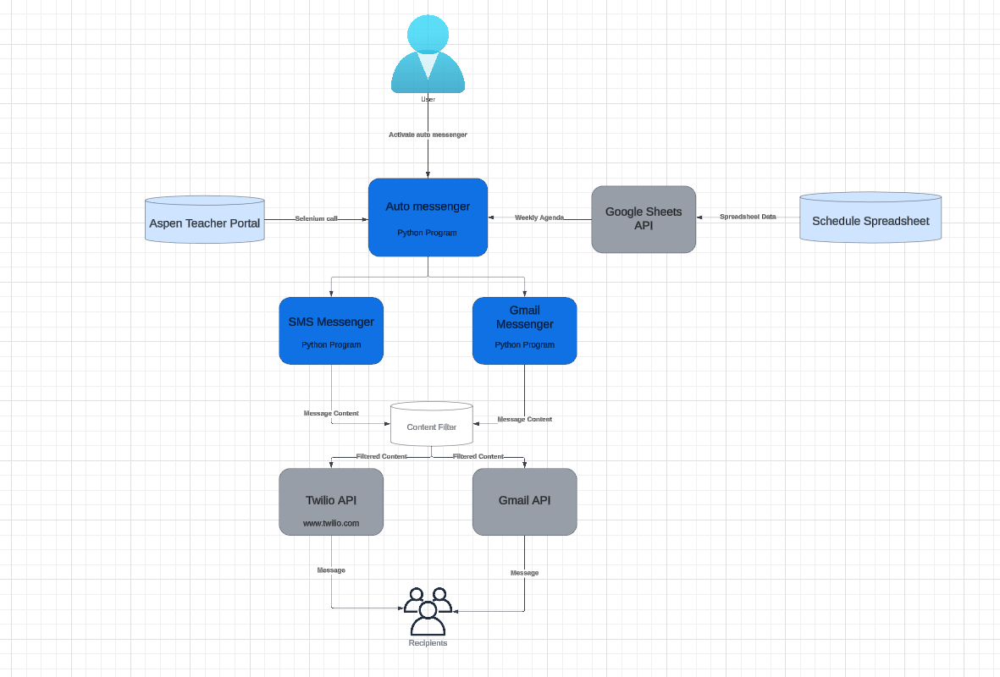

# Auto Parent Updater 
## Description
- **Product**:
  - Program that regularly updates parents on class content
  - Uses Google Sheets API to retrieve schedule information
  - Utilizes Gmail and Twilio API to send messages
  - Runs on a regular interval using Kron

## User Guide

- Requirements: Assigned to Kron as a Job, Twilio auth tokens, Aspen teacher access, filter dictionaries,a one time input of class code any and all classes (individually) as well as user name and password (all are variables found in the code) to obtain parent emails, phone numbers and student birthdays, all put into text documents labeled for their content.
- pip install -r .\requirements.txt for required packages