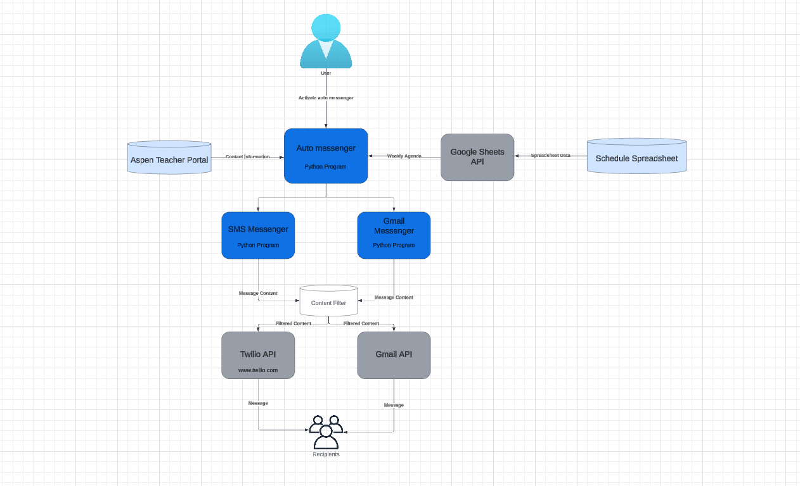

# Auto Parent Updater 
## Description
- **Product**:
  - Program that regularly updates parents on class content
  - Uses Google Sheets API to retrieve schedule information
  - Utilizes Gmail and Twilio API to send messages
  - Runs on a regular interval using Kron

## User Guide

- Requirements: Assigned to Kron as a Job, Twilio auth tokens, Aspen teacher access, filter dictionaries